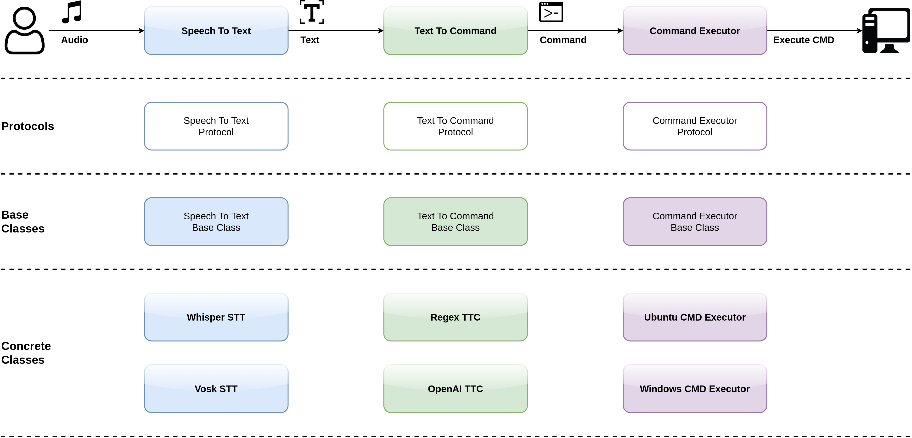

# HMI Apps

Workflow:

# Coding Standard:
- Concrete classes of a module must only depend on classes in the same module or Protocols or Base Classes of other modules.

# Logging:
- Which levels to use ...